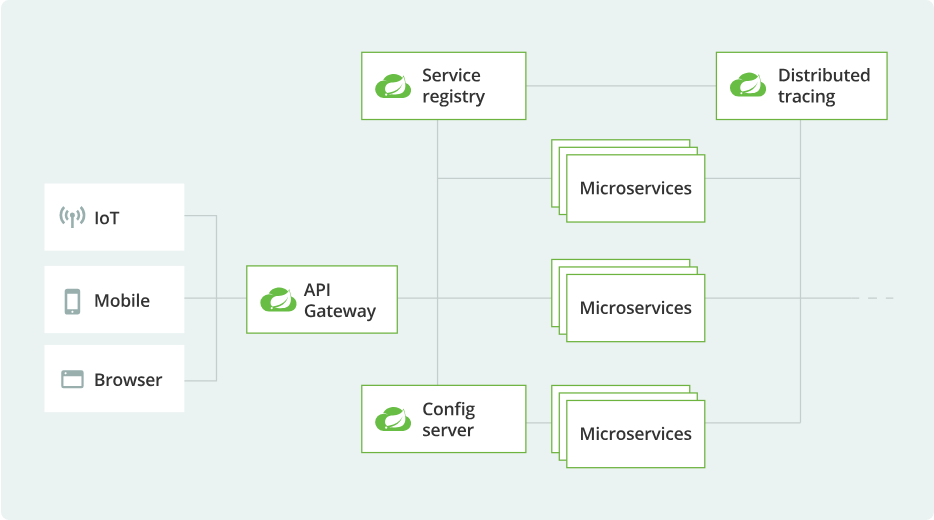

# Spring Cloud Learning
内容持续更新中...

# 简介

这是本人自己在学习 Spring Cloud 微服务过程中对其中的相关技术的编写的示例Demo，希望可以对一些正在学习该方面的小伙伴提供帮助。

# 环境

# 目录

### 1.Spring Cloud 基础部分

- <a href="https://blog.csdn.net/qq_45747519/article/details/114459723?spm=1001.2014.3001.5501" target="_blank">Spring Cloud 简介</a>
- <a href="https://blog.csdn.net/qq_45747519/article/details/114580662?spm=1001.2014.3001.5501" target="_blank">Spring Cloud Rest</a>
- <a href="https://blog.csdn.net/qq_45747519/article/details/114581016?spm=1001.2014.3001.5501" target="_blank">Spring Cloud Eureka</a>
- <a href="https://blog.csdn.net/qq_45747519/article/details/114581342?spm=1001.2014.3001.5501" target="_blank">Spring Cloud Ribbon</a>
- <a href="https://blog.csdn.net/qq_45747519/article/details/114581511?spm=1001.2014.3001.5501" target="_blank">Spring Cloud Hystrix</a>
- <a href="https://blog.csdn.net/qq_45747519/article/details/114581886?spm=1001.2014.3001.5501" target="_blank">Spring Cloud Feign</a>

### 2.Spring Cloud 进阶部分

- <a href="https://blog.csdn.net/qq_45747519/article/details/114582038?spm=1001.2014.3001.5501" target="_blank">Spring Cloud Zuul</a>
- <a href="https://blog.csdn.net/qq_45747519/article/details/114582163?spm=1001.2014.3001.5501" target="_blank">Spring Cloud Config</a>
- <a href="https://blog.csdn.net/qq_45747519/article/details/114787980" target="_blank">Spring Cloud Consul</a>
- <a href="https://blog.csdn.net/qq_45747519/article/details/114788686" target="_blank">Spring Cloud Gateway</a>
- <a href="https://blog.csdn.net/qq_45747519/article/details/114789229" target="_blank">Spring Cloud Bus</a>
- <a href="https://blog.csdn.net/qq_45747519/article/details/115102591" target="_blank">Spring Cloud Sleuth</a>

### 3.Spring Cloud Alibaba部分

- <a href="https://blog.csdn.net/qq_45747519/article/details/115102634" target="_blank">Spring Cloud Alibaba 简介</a>
- <a href="https://blog.csdn.net/qq_45747519/article/details/115102706" target="_blank">Spring Cloud Alibaba Nacos</a>
- <a href="https://blog.csdn.net/qq_45747519/article/details/115102737" target="_blank">Spring Cloud Alibaba Sentinel</a>
- <a href="">Spring Cloud Alibaba Seata</a>

### 4.Spring Cloud Security部分

- <a href="">Spring Cloud Security 整合 Oauth2</a>
- <a href="">Spring Cloud Security 整合 JWT</a>
- <a href="">Spring Cloud Security 实现单点登录</a>

### 5.Spring Cloud 扩展部分

- <a href="">Spring Cloud Gateway 整合 Swagger文档</a>
- <a href="">Spring Cloud Zuul 整合 Swagger文档</a>
